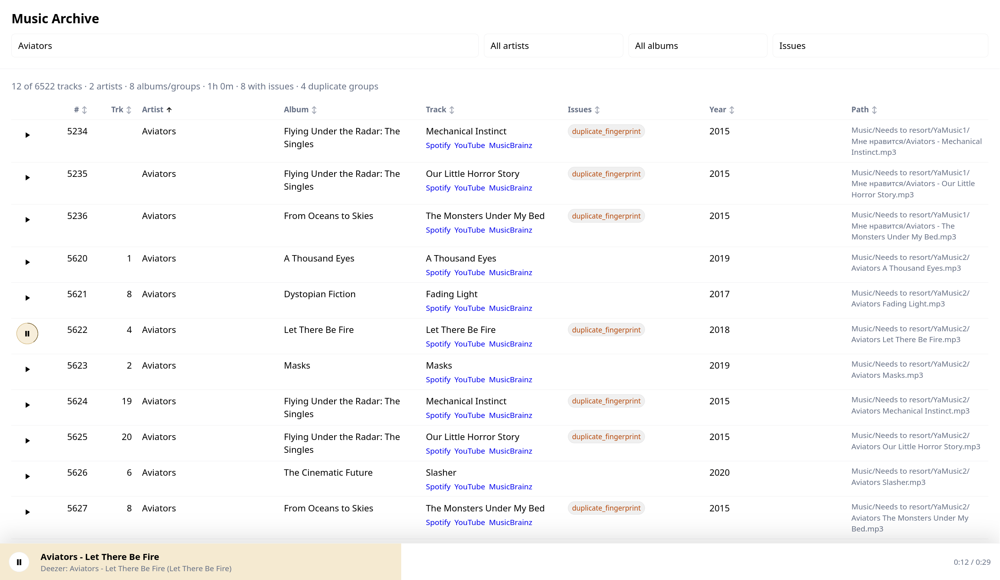

# Music Archive CLI

Archive your local music library before deleting the files.

`music-archive` scans a directory of audio files and generates:

- `music.json` with selected metadata, raw source metadata, SHA256 hashes, and optional Chromaprint fingerprints;
- `Music.md` with a readable artist/album/track outline;
- a static local browser app with filtering, issue badges, duplicate detection, metadata details, and 30-second preview lookup through Deezer and iTunes.

The intended use case is simple: you no longer want to keep a local music library, but you still want a durable record that can help you remember, search for, or rebuild the collection later.



## Install

From a checkout:

```sh
python3 -m pip install .
```

For development:

```sh
python3 -m pip install -e .
```

## Usage

```sh
music-archive /path/to/Music --output /path/to/music-archive
```

Then open the generated viewer:

```sh
cd /path/to/music-archive
./serve.sh
```

Open:

```text
http://127.0.0.1:8765/
```

## Fingerprints

Chromaprint fingerprints are generated with `fpcalc` when it is available on `PATH`.

Install examples:

```sh
sudo apt install libchromaprint-tools
```

Skip fingerprints:

```sh
music-archive /path/to/Music --output /path/to/music-archive --no-fingerprints
```

## Hashes

SHA256 hashes are generated by default. They identify exact files, while Chromaprint identifies audio content more loosely.

Skip hashes:

```sh
music-archive /path/to/Music --output /path/to/music-archive --no-hashes
```

## Metadata Strategy

The generated JSON keeps both selected values and source values:

- root fields such as `artist`, `album`, and `title` are the selected values used by the viewer;
- `metadata_sources.path` stores values inferred from directory structure;
- `metadata_sources.filename` stores values inferred from file names;
- `metadata_sources.tags` stores raw and repaired tag values;
- `metadata_sources.selected` records which source was used.

This makes the archive useful even when some files have broken tags, spammy tags, mojibake, or missing album data.

## Preview Playback

The generated viewer can try to play a short preview using Deezer first and iTunes as a fallback. It does not store preview URLs in `music.json`.

Preview lookup depends on third-party catalogs and may fail or match a different version.

## License

0BSD. See [LICENSE](LICENSE).
